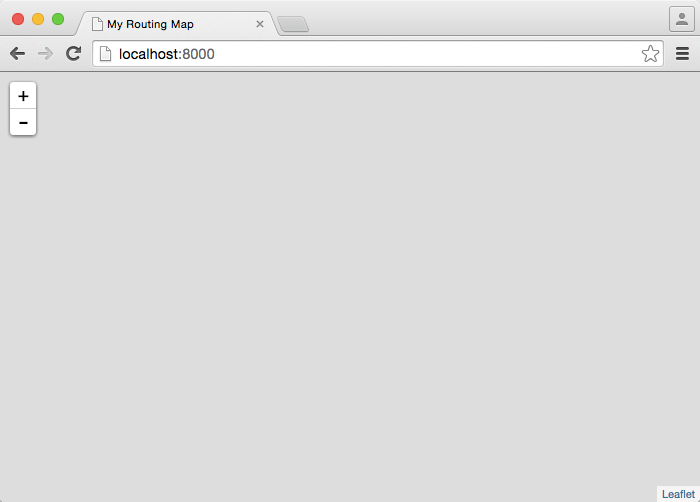
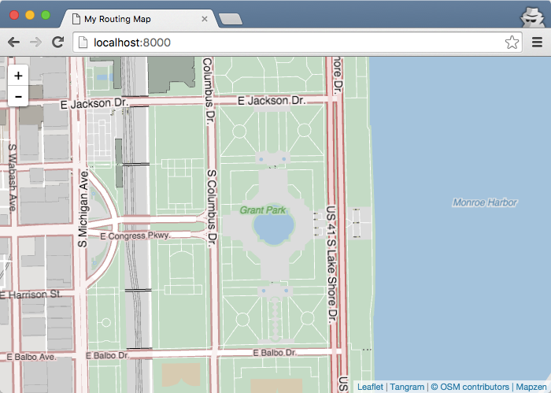
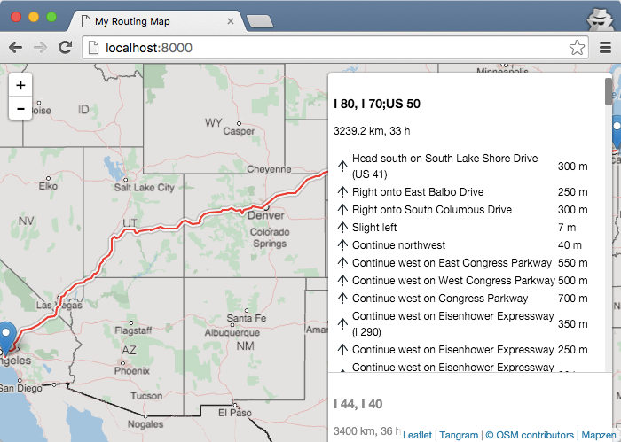
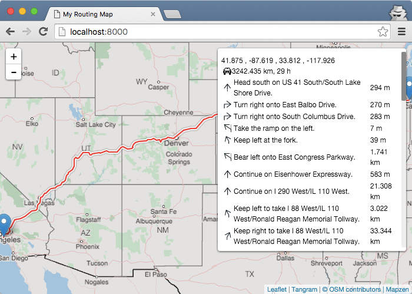
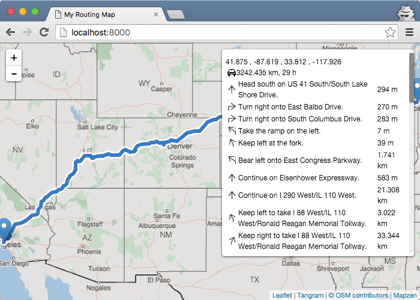
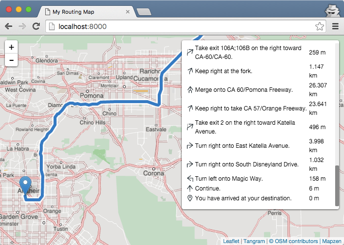

# Add Mapzen Turn-by-Turn routing to a map

Mapzen Turn-by-Turn, which is a routing service powered by the Valhalla engine, adds routing and navigation to web or mobile applications. The service works globally, and provides dynamic and customizable routing by driving, walking, or bicycling, with clear directions for maneuvers along the route. In this walkthrough, you will learn how to make a map featuring Mapzen Turn-by-Turn. The map you create will provide:

- a route line between map locations (also known as waypoints)
- a text narrative of maneuvers to perform on the route
- distances along your route and estimated travel times
- functionality to drag the route start and endpoints to get a different path
- the ability change the mode of transportation, such as automobile or pedestrian

In this walkthrough, you will be planning a family [vacation](https://en.wikipedia.org/wiki/National_Lampoon%27s_Vacation) for travel by car from your home of Chicago, Illinois to visit a popular theme park in Anaheim, California. In your code, you will enter the start and end points of your trip and Mapzen Turn-by-Turn will calculate the route.

To complete the tutorial, you should have some familiarity with HTML and JavaScript, although all the source code is provided. You will need an [API key](https://mapzen.com/developers) to use Mapzen Turn-by-Turn, which requires a GitHub account for authorization. You can use any text editor and operating system, but must maintain an Internet connection while you are working. The tutorial should take about an hour to complete.

The map also uses other Mapzen technology, including the [vector tile service](https://mapzen.com/projects/vector-tiles/) and the [Tangram graphics engine](https://mapzen.com/projects/tangram) to draw the features on the map.

## Sign up for a Mapzen Turn-by-Turn API key
To use the routing service, you must first obtain a developer API key from Mapzen. Sign in at https://mapzen.com/developers to create and manage your API keys.

Mapzen Turn-by-Turn is a shared routing service. As such, there are limitations on requests, maximum distances, and numbers of locations to prevent individual users from degrading the overall system performance.

1. Go to https://mapzen.com/developers.
2. Sign in with your GitHub account. If you have not done this before, you need to agree to the terms first.
3. Create a new key, and optionally, give it a project name so you can remember the purpose of the key.
4. Keep the web page open so you can copy the key into the source code later.

## Download and install the dependencies

When you request a route from Mapzen Turn-by-Turn, you are sending and receiving [JSON](https://en.wikipedia.org/wiki/JSON), which is a human-readable text format. This JSON can then be drawn on a map and shown as instructions for maneuvers along the route. The Leaflet JavaScript library, which provides tools for zooming, displaying attributions, and drawing symbols, is one way you can display routes on web and mobile maps. Leaflet is extensible, and developers have built additional tools for Leaflet maps, including the [Leaflet Routing Machine (LRM)](http://www.liedman.net/leaflet-routing-machine/) and Mapzen plug-ins for routing.

To set up your development environment for this walkthrough, you need to download Leaflet and the Leaflet Routing Machine and Mapzen Turn-by-Turn plug-ins. There are several ways you can obtain these files, including through a package manager, such as [npm](https://www.npmjs.com/). If you want to use other methods, see the documentation for those products.

If you find links for multiple versions of the required libraries, you should download the latest stable release for these files.

1. Create a new folder on your machine named `routing-tutorial`. You will use this folder as your working directory where you can store the downloaded files.
2. Download Leaflet from http://leafletjs.com/download.html.
3. Download Leaflet Routing Machine from https://github.com/perliedman/leaflet-routing-machine/releases.
4. Download LRM-Mapzen from http://mapzen.com/resources/lrm-mapzen-0.1.2.zip.
5. Unzip the files you downloaded and move the subfolders to your main working folder.
6. For simplicity, rename the subfolders inside your `routing-tutorial` folder to remove the release numbers. For example, rename the `lrm-mapzen-0.1.2` folder to `lrm-mapzen`.

    

## Create an index page

Now that you have downloaded the required dependent files, you are ready to start building your application. If you are using the [Node.js](https://nodejs.org/) framework or are adding routing to an existing web application, you may want to use a different file organization. This example uses the simplest structure, a single index.html file.

1. At the root level of your working folder, create a file called index.html and open it in a text editor.

    

2. Add the basic HTML tags, including `<!DOCTYPE HTML>`, `<html>`, `<head>`, and `<body>`. Your HTML might look like this:

    ```html
    <!DOCTYPE html>
    <html>
    <head>
    </head>
    <body>
    </body>
    </html>
    ```

3. In the `<head>` tag, add a title, such as `<title>My Routing Map</title>`.
4. Save your edits to the index.html file.

You HTML should look like this:
```html
<!DOCTYPE html>
<html>
<head>
  <title>My Routing Map</title>
</head>
<body>
</body>
</html>
```

## Start a server to get the project running locally

To see your changes on a Tangram map, you need to start a local web server on your machine. You need a web server because some scripts could be blocked by your browser’s security settings.

1. Open a terminal window in the path of your working folder. For example, if your files are in your documents folder, you can type `cd documents/routing-tutorial` (where `cd` means to change the active directory) to navigate to your working folder.
2. At the prompt, type `python -m SimpleHTTPServer` to start a web server using Python. You should receive a message similar to this in the terminal: `Serving HTTP on 0.0.0.0 port 8000 ...`. If you are having problems, you can instead try the command `python -m http.server 8000` (for use with Python 3).

    

3. Open your browser to `http://localhost:8000`. (Localhost is a shortcut hostname that a computer can use to refer to itself, and is not viewable by anyone else.)

If the step was successful, you should see a blank index page with your title (My Routing Map) showing in the browser tab.


## Add references to CSS and JavaScript files

Because you are working with several external cascading style sheet (CSS) and JavaScript files, you need to add references to them in your index.html file. These include style sheets and JavaScript files for Leaflet, Leaflet Routing Machine, and Mapzen Turn-by-Turn. You will need to add these into the <head> and <body> sections of the index.html.

You will need to modify the path to reflect your working directory if you are not using the folder names suggested in the earlier section.

1. In index.html, in the `<head>` section, add a reference to your Leaflet CSS file.

    ```html
    <link rel="stylesheet" href="leaflet/leaflet.css">
    ```

2. In the `<head>` section, add reference to the Mapzen CSS file. This file can be used instead of the Leaflet Routing Machine CSS file because it contains all the LRM icons, as well as additional ones for Mapzen Turn-by-Turn.

    ```html
    <link rel="stylesheet" href="lrm-mapzen/leaflet.routing.mapzen.css">
    ```

3. In the `<body>` section, add the Leaflet JavaScript file.

    ```html
    <script src="leaflet/leaflet.js"></script>
    ```

4. Add the Tangram JavaScript file, which is the rendering engine you will be using to draw the map.

    ```html
    <script src="https://mapzen.com/tangram/tangram.min.js"></script>
    ```

5. Add the Leaflet Routing Machine JavaScript file.

    ```html
    <script src="leaflet-routing-machine/dist/leaflet-routing-machine.js"></script>
    ```

6. Add the Mapzen JavaScript file.

    ```html
    <script src="lrm-mapzen/lrm-mapzen.js"></script>
    ```

7. Save your edits and refresh the browser.

After adding these, your index.html file should look something like this. Note that JavaScript can be inserted in either the `<head>` or the `<body>`, but the `<body>` may improve loading of the page.

```html
<!DOCTYPE html>
<html>
<head>
  <title>My Routing Map</title>
  <link rel="stylesheet" href="leaflet/leaflet.css">
  <link rel="stylesheet" href="lrm-mapzen/leaflet.routing.mapzen.css">
</head>
<body>
  <script src="leaflet/leaflet.js"></script>
  <script src="https://mapzen.com/tangram/tangram.min.js"></script>
  <script src="leaflet-routing-machine/dist/leaflet-routing-machine.js"></script>
  <script src="lrm-mapzen/lrm-mapzen.js"></script>
</body>
</html>
```

At this point, your browser page is still empty. As you are working, it’s a good idea to save your edits and periodically reload the browser page. This helps you identify problems quicker and trace them back to your most recent changes. You should also monitor the terminal window for status messages. If your code is working properly, you should see a message of 200 in the terminal window, as 200 is the HTTP response code for successful requests.

However, seeing a 404 error often means that the file cannot be found. You should make sure the paths in your HTML match the locations on disk before you continue further.


## Add a map to the page
To display a Leaflet map on a page, you need a `<div>` element with an ID value, as well as a size for the box containing the map. Then, you can add the code to set the map and use Tangram to render it. If you want to know more about initializing a Leaflet map, see the [Leaflet getting started documentation](http://leafletjs.com/examples/quick-start.html).

1. At the bottom of the `<head>` section, add a `<style>` tag and the following size attributes to set the size of the map.

    ```html
    <style>
      #map {
        height: 100%;
        width: 100%;
        position: absolute;
      }
    </style>
    ```

2. At the top of the `<body>` section, add the `<div>`.

    ```html
    <div id="map"></div>
    ```

3. Immediately after the other `<script>` references, add the following JavaScript within a `<script>` tag to initialize Leaflet. `L.xxxxx` is a convention used with the Leaflet API. To make sure the scripts load in the proper order, this code must be placed after the dependencies.

    ```html
    <script>
      var map = L.map('map');
    </script>
    ```

4. Save your edits and refresh the browser. You should see a gray canvas with zoom controls and a Leaflet attribution in the bottom corner.

    

Your index.html should look something like this:

```html
<!DOCTYPE html>
<html>
<head>
  <title>My Routing Map</title>
  <link rel="stylesheet" href="leaflet/leaflet.css">
  <link rel="stylesheet" href="lrm-mapzen/leaflet.routing.mapzen.css">
  <style>
  #map {
    height: 100%;
    width: 100%;
    position: absolute;
  }
  </style>
</head>
<body>
  <div id="map"></div>
  <script src="leaflet/leaflet.js"></script>
  <script src="https://mapzen.com/tangram/tangram.min.js"></script>
  <script src="leaflet-routing-machine/dist/leaflet-routing-machine.js"></script>
  <script src="lrm-mapzen/lrm-mapzen.js"></script>
  <script>
    var map = L.map('map');
  </script>
</body>
</html>
```

## Add a Tangram map to the frame

At this point, you have enabled the basic Leaflet controls and have a canvas for your map, but still need to tell Leaflet to use Tangram to draw the contents of the map.

Tangram uses a scene file in .yaml format to specify the what it should draw and how the features should appear in the map. A basic scene file has a reference to a data source (in this case, OpenStreetMap data from Mapzen’s [vector tile service](https://mapzen.com/projects/vector-tiles) and the colors and types of features to draw. This scene file includes a demonstration API key for use with the vector tile service in this tutorial; if you want to put this map into production, you should obtain your own [API key](https://mapzen.com/developers).

In the code you will add, the `scene:` item sets the Tangram scene file to use for drawing and `attribution:` is what appears in the bottom corner of the map as the map attribution, overriding the default Leaflet attribution. This source code links to a scene file created by Mapzen, but you can modify the `scene:` parameter to point to a scene hosted at a different URL or a local file.

Note that Tangram and the vector tile service are not required for Mapzen Turn-by-Turn routing. If you prefer to use other data, refer to the [Leaflet documentation](http://leafletjs.com/reference.html) to learn how reference tile layers in a map.

1. Inside the `<script>` tags, immediately after the `var map = L.map('map');` line, add the following code to use Tangram.

    ```js
    var layer = Tangram.leafletLayer({
      scene: 'https://raw.githubusercontent.com/tangrams/cinnabar-style/gh-pages/cinnabar-style.yaml',
      attribution: '<a href="https://mapzen.com/tangram" target="_blank">Tangram</a> | <a href="http://www.openstreetmap.org/about" target="_blank">&copy; OSM contributors | <a href="https://mapzen.com/" target="_blank">Mapzen</a>',
    });
    layer.addTo(map);
    ```

2. On the next line, immediately after `layer.addTo(map);`, add a line to initialize the map display. This sets the extent of the map and the zoom level. The map is centered on Chicago, Illinois, with a zoom level that allows you to see the streets and features of the city. Zoom levels are similar to map scales or resolutions, where a smaller value shows a larger area in less detail, and a larger zoom level value depicts smaller area in great detail.

    ```js
    map.setView([41.8758,-87.6189], 16);
    ```

3. Save your edits and refresh the browser. You should see Leaflet map controls and an updated attribution, and the map should be centered at the location specified.

    

Your `<body>` section should look like this:

```html
[...]
<body>
  <div id="map"></div>
  <script src="leaflet/leaflet.js"></script>
  <script src="https://mapzen.com/tangram/tangram.min.js"></script>
  <script src="leaflet-routing-machine/dist/leaflet-routing-machine.js"></script>
  <script src="lrm-mapzen/lrm-mapzen.js"></script>
  <script>
  var map = L.map('map');
  var layer = Tangram.leafletLayer({
    scene: 'https://raw.githubusercontent.com/tangrams/cinnabar-style/gh-pages/cinnabar-style.yaml',
    attribution: '<a href="https://mapzen.com/tangram" target="_blank">Tangram</a> | <a href="http://www.openstreetmap.org/about" target="_blank">&copy; OSM contributors | <a href="https://mapzen.com/" target="_blank">Mapzen</a>',
  });
  layer.addTo(map);
  map.setView([41.8758,-87.6189], 16)
  </script>
</body>
[...]
```

If your map is not loading properly, first check the terminal window for status messages and resolve any 404 errors. You can also copy the example source code at the end of the section in case you mistyped any of the steps. If your project worked until now, ensure that your browser has WebGL support enabled (although it is unusual for it to be turned off) or turn on the developer tools in your browser to see if you can debug further. If you are still having trouble, add an issue to the [documentation GitHub repository](https://github.com/valhalla/valhalla-docs/issues) so it can be investigated.

## Add waypoints for routing

So far, you have referenced the necessary files, initialized Leaflet with a map container on the  page, and added Tangram to the map. Now, you are ready to add the routing code to your page using the Leaflet Routing Machine plug-in.

In the simplest implementation, your map will not provide the ability to search for places through geocoding or inputting coordinates otherwise. Therefore, you need to set the waypoints in your code. As you add functionality to your web page, you can set the initial coordinates through user interaction.

1. Add `//` at the beginning of the `map.setView([41.8758,-87.6189], 16)` line to comment out that code. You no longer need to set the extent manually like this because the routing environment will be specifying it.

    ```js
    //map.setView([41.8758,-87.6189], 16)
    ```

2. Inside the `<script>` tag, and after the commented line, initialize routing with the following code. You can substitute your own coordinates for the start and end locations of the routing. These coordinates take you from Chicago, Illinois, to the entrance gates of the theme park in Anaheim, California.

    ```js
    L.Routing.control({
      waypoints: [
        L.latLng(41.8758,-87.6189),
        L.latLng(33.8128,-117.9259)
      ]
    }).addTo(map);
    ```

    
    <p class='caption'>This map shows the default route and driving directions from Leaflet Routing Machine, which uses Open Source Routing Machine (OSRM) as the underlying routing engine.</p>

Your `<body>` section should look like this:

```html
[...]
<body>
  <div id="map"></div>
  <script src="leaflet/leaflet.js"></script>
  <script src="https://mapzen.com/tangram/tangram.min.js"></script>
  <script src="leaflet-routing-machine/dist/leaflet-routing-machine.js"></script>
  <script src="lrm-mapzen/lrm-mapzen.js"></script>
  <script>
  var map = L.map('map');
  var layer = Tangram.leafletLayer({
    scene: 'https://raw.githubusercontent.com/tangrams/cinnabar-style/gh-pages/cinnabar-style.yaml',
    attribution: '<a href="https://mapzen.com/tangram" target="_blank">Tangram</a> | <a href="http://www.openstreetmap.org/about" target="_blank">&copy; OSM contributors | <a href="https://mapzen.com/" target="_blank">Mapzen</a>',
  });
  layer.addTo(map);
  //map.setView([41.8758,-87.6189], 16)
  L.Routing.control({
    waypoints: [
      L.latLng(41.8758,-87.6189),
      L.latLng(33.8128,-117.9259)
    ]
  }).addTo(map);
  </script>
</body>
[...]
```

## Set Mapzen Turn-by-Turn as the routing engine

By default, the Leaflet Routing Machine plug-in uses [Open Source Routing Machine (OSRM)](http://project-osrm.org/) to perform the routing queries, so you need to substitute Mapzen Turn-by-Turn as the routing engine. To use a different engine, you need to set the `router:` to Mapzen and initialize a `formatter:` with functions for units and other conversions.

1. Replace the code within the `L.Routing.control` block with the following code to change the routing engine to Mapzen Turn-by-Turn. By including a `summaryTemplate`, the directions can include totals of the length and expected time en route. Note that the `router:` has two items with placeholders; you will update these in the next steps.

    ```js
    [...]
    L.Routing.control({
      waypoints: [
        L.latLng(41.8758,-87.6189),
        L.latLng(33.8128,-117.9259)
      ],
      router: L.Routing.mapzen('valhalla-xxxxxx', 'your-routing-mode',
      formatter: new L.Routing.Mapzen.Formatter(),
      summaryTemplate:'<div class="start">{name}</div><div class="info {transitmode}">{distance}, {time}</div>',
      routeWhileDragging: false
    }).addTo(map);
    [...]
    ```

2. Go back to the https://mapzen.com/developers page and copy your API key to the clipboard. You need to replace these with your own API key and the routing mode you want to use in your map.
3. Paste your own API key in place of `valhalla-xxxxxx` inside the single quotes. The routing will only load if you use a valid API key.
4. Change `your-routing-mode` to `auto` to perform routing by automobile, again maintaining the single quotes.

    ```js
    router: L.Routing.mapzen('valhalla-xxxxxx', 'auto'),
    ```

5. Save your edits and refresh the browser. You should see a map, the route line, and updated icons and summary text in the narration box. The maneuver instructions are simpler and more concise.

    
    <p class='caption'>This map shows the Mapzen Turn-by-Turn routing engine with simplified narration and driving instructions.</p>

The `<body>` section should look something like this, but with your own API key for the `router`:

```html
[...]
<body>
  <div id="map"></div>
  <script src="leaflet/leaflet.js"></script>
  <script src="https://mapzen.com/tangram/tangram.min.js"></script>
  <script src="leaflet-routing-machine/dist/leaflet-routing-machine.js"></script>
  <script src="lrm-mapzen/lrm-mapzen.js"></script>
  <script>
    var map = L.map('map');
    var layer = Tangram.leafletLayer({
      scene: 'https://raw.githubusercontent.com/tangrams/cinnabar-style/gh-pages/cinnabar-style.yaml',
      attribution: '<a href="https://mapzen.com/tangram" target="_blank">Tangram</a> | <a href="http://www.openstreetmap.org/about" target="_blank">&copy; OSM contributors | <a href="https://mapzen.com/" target="_blank">Mapzen</a>',
    });
    layer.addTo(map);
    //map.setView([41.8758,-87.6189], 16)
    L.Routing.control({
      waypoints: [
        L.latLng(41.8758,-87.6189),
        L.latLng(33.8128,-117.9259)
      ],
      router: L.Routing.mapzen('valhalla-xxxxxx', 'auto'),
      formatter: new L.Routing.Mapzen.Formatter(),
      summaryTemplate:'<div class="start">{name}</div><div class="info {transitmode}">{distance}, {time}</div>',
      routeWhileDragging: false
    }).addTo(map);
  </script>
</body>
[...]
```

Mapzen Turn-by-Turn also provides the ability to specify additional waypoints through which your route should pass, such as visiting family in Kansas and Arizona and bobbing your head at Grand Canyon National Park. Currently, you can drag the start and end points (and add waypoints in between) to update the routing, but the route will not be recalculated until you drop the points. On your own, you can set the option for `routeWhileDragging` to `true` if you want to update the route while moving points on the map, although this can be slow and costly to make many queries. You can read more about the options available for `L.Routing.control` in the [Leaflet Routing Machine API documentation](http://www.liedman.net/leaflet-routing-machine/api/).

## Change the route line color

The symbols for the basemap are set in the scene file, but the route line may be hard distinguish from the roads in your map. You can use `L.routing.control` to update the color of the route line.

1. After the closing line of the `waypoints:` block and immediately before the `router:` block, insert the following source code:

    ```js
    lineOptions: {
      styles: [ {color: 'white',opacity: 0.8, weight: 12},
              {color: '#2676C6', opacity: 1, weight: 6}
    ]},
    ```

2. Save your edits and refresh the browser. The line should change to blue and look thicker than before.

    

3. Click through the points in the directions list to pan and zoom the map to the location of each maneuver, including your destination.

    

The `<body>` section should look something like this, but with your own API key for the `router`:

```html
[...]
<body>
  <div id="map"></div>
  <script src="leaflet/leaflet.js"></script>
  <script src="https://mapzen.com/tangram/tangram.min.js"></script>
  <script src="leaflet-routing-machine/dist/leaflet-routing-machine.js"></script>
  <script src="lrm-mapzen/lrm-mapzen.js"></script>
  <script>
    var map = L.map('map');
    var layer = Tangram.leafletLayer({
      scene: 'https://raw.githubusercontent.com/tangrams/cinnabar-style/gh-pages/cinnabar-style.yaml',
      attribution: '<a href="https://mapzen.com/tangram" target="_blank">Tangram</a> | <a href="http://www.openstreetmap.org/about" target="_blank">&copy; OSM contributors | <a href="https://mapzen.com/" target="_blank">Mapzen</a>',
    });
    layer.addTo(map);
    //map.setView([41.8758,-87.6189], 16);
    L.Routing.control({
      waypoints: [
        L.latLng(41.8758,-87.6189),
        L.latLng(33.8128,-117.9259)
      ],
      lineOptions: {
        styles: [ {color: 'white',opacity: 0.8, weight: 12},
          {color: '#2676C6', opacity: 1, weight: 6}
        ]},
      router: L.Routing.mapzen('valhalla-xxxxxx', 'auto'),
      formatter: new L.Routing.Mapzen.Formatter(),
      summaryTemplate:'<div class="start">{name}</div><div class="info {transitmode}">{distance}, {time}</div>',
      routeWhileDragging: false
    }).addTo(map);
  </script>
</body>
[...]
```

## Walkthrough summary and next steps

In this walkthrough, you learned the basics of making a map with Mapzen Turn-by-Turn routing. You can now take what you have learned and add more functionality to your map and embed it in your own projects. For example, you may want to add code to allow the user to pick routing locations with a button, change the transportation mode used for routing, or set other options. Each of the routing modes Mapzen Turn-by-Turn supports has many options that can be used to influence the output route and estimated time. For example, automobile routing allows you to set penalties and costs to avoid toll roads or crossing international borders, and bicycle routing allows you to specify the category of bicycle so you are routed on appropriate paths for your equipment.

You can review the [documentation](https://mapzen.com/documentation/turn-by-turn/) to learn more about routing with Mapzen Turn-by-Turn.
